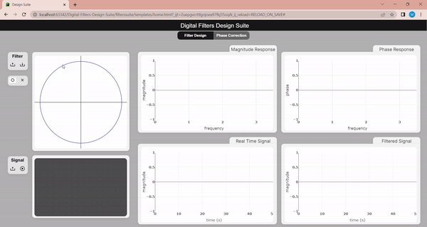
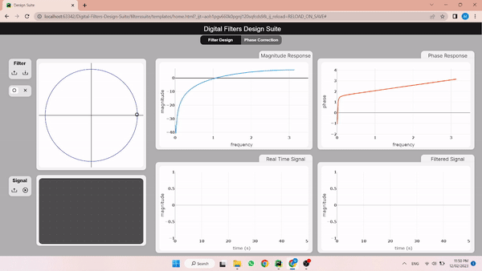
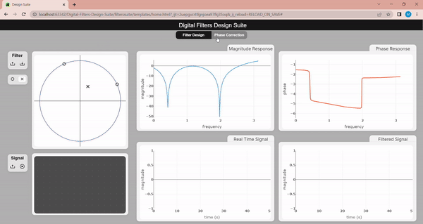

# Digital-Filters-Design-Suite

## Table of contents:
- [Introduction](#introduction)
- [Project Features](#project-features)
- [Project Structure](#project-structure)
- [Quick Preview](#quick-preview)
- [How to Run The Project](#run-the-project)
- [Team]()


### Introduction
Digital Filters Design Suite is a web application that allows the user to design their real-time digital filters using zeros and
poles placements on Z complex plane and correct the filter's phase response using all-pass filters through desired values
of all-pass A-Value or select from multiple examples of pre-designed all pass filters.

### Project Features
In this project you can:
- [x] Add Zeros & Poles to Z-Plane unit circle.
- [x] Drag the drawn Zeros & Poles on Z-Plane unit circle.
- [x] Get Magnitude & Phase response of the designed filter.
- [x] Upload Signal to apply the filter on it realtime.
- [x] Play/Pause the realtime signal.
- [x] Create real-time signal to see the filter response with on screen mouse-pad.
- [x] Add multiple all-pass filters to correct the phase response of the designed filter.
- [x] Select from pre-designed all-pass filters catalog to apply for your filter.


### Project Structure
The Web Application is built using:
- Frontend:
  - HTML
  - CSS
  - JavaScript
  - Konva.js
  - Ajax
  - BootStrap
  - jQuery
- Backend framework:
  - Django (Python)

The Frontend main function to set the structure of the page and let the user interact with the page through
viewing unit circle, add zeros & poles, and see realtime signals. It also sends the data to the backend to create the
filter and then return the phase & Magnitude responses to the frontend to display it to the user. We use Ajax to send
asynchronous requests to the server. The Backend main function is to create filters, get all-pass responses and apply 
them to the filter creating a new filter.

```
master
├─  filterssuite
│  ├─  nootbooks 
│  ├─  static (js, css & images)
│  ├─  templates (HTML)
│  ├─  apps.py (application configuration)
│  ├─  urls.py (application routing)
│  ├─  views.py (application endpoints)
│  └─  digital_filter.py (filter Class)
├─  server
├─  manage.py (server manager)
├─  README.md
└─  requirements.txt
```

### Quick Preview

#### Add & Drag Multiple Zeros & Poles to the unit circle.

#### Upload Signals, Apply the Filter on it & play/pause it.

#### Low Pass Filter

#### High Pass Filter

#### Band Pass Filter

#### Band Stop (Notch) Filter

#### Phase Correction & Catalog of All-Pass Filters


### Run the Project 
1. Install Python3 in your computer
``` 
Download it from www.python.org/downloads/
```
2. Install the required packages
```
pip install -r requirments.txt
```
3. Run the Backend Server
```shell
python manage.py runserver
```

4. visit http://localhost/suite/home
or open the HTML page directly from the browser (in case the css is not loaded correctly)

### Team

First Semester - Biomedical Digital Signal Processing (SBE3110) class project created by:

| Team Members' Names                                  | Section | B.N. |
|------------------------------------------------------|:-------:|:----:|
| [Ibrahim Mohamed](https://github.com/1brahimmohamed) |    1    |  2   |
| [Mahmoud Yaser](https://github.com/mahmoud1yaser)    |    2    |  30  |
| [Maye Khaled](https://github.com/mayekhaled0)        |    2    |  40  |
| [Mariam Wael](https://github.com/MariamWaell)        |    2    |  36  |

### Submitted to:
- Dr. Tamer Basha & Eng. Abdallah Darwish
All rights reserved © 2022 to Team 12 - Systems & Biomedical Engineering, Cairo University (Class 2024)